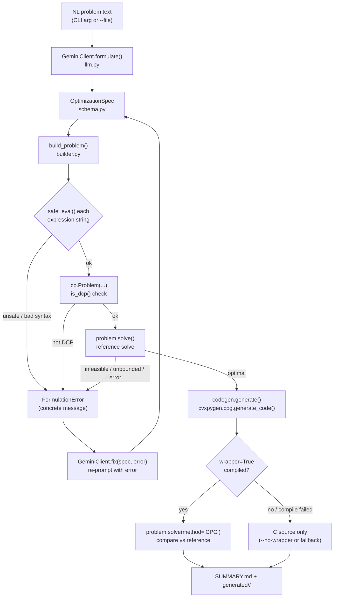

# nl2cvxpygen — Architecture & Implementation Guide

This document explains how the codebase is put together and, more importantly, where to
hook in when you want to extend it — a new LLM backend, a new pipeline stage ("agent"),
or broader problem scope. It assumes you've read the top-level [README.md](README.md) once.

## 1. Mental model in one paragraph

The LLM is used for exactly one thing: turning problem *text* into problem *structure*
(an `OptimizationSpec` — variable/parameter declarations and a handful of expression
strings). It never writes a program we run. Everything after that — building real
`cvxpy` objects, evaluating those expression strings, checking DCP compliance, solving,
calling `cvxpygen`, and verifying the generated code — is deterministic Python that
either succeeds or produces a concrete error we can feed back to the LLM for a retry.
That split (LLM = structure extraction, code = everything else) is the one idea worth
holding onto before reading anything else below.

## 2. Pipeline walkthrough



Retries are bounded by `--retries` (default 2, in `cli.py::_formulate_with_retries`). Each
failed attempt's `FormulationError` message is exactly what gets appended to the next
prompt via `prompts.build_fix_prompt` — so the quality of those error messages *is* the
quality of the self-correction loop. Keep them concrete (name the offending expression,
say why) when you touch `builder.py`.

## 3. Repo layout

```
agentCVXPY/
├── pyproject.toml            deps + `nl2cvxpygen` console script
├── .env.example               GEMINI_API_KEY / GEMINI_MODEL
├── src/nl2cvxpygen/
│   ├── schema.py               OptimizationSpec (the only LLM output)
│   ├── prompts.py               system prompt + few-shot rules
│   ├── llm.py                   Gemini client (formulate / fix)
│   ├── safe_eval.py             AST-whitelisted sandboxed eval()
│   ├── builder.py               spec -> cvxpy.Problem -> reference solve
│   ├── codegen.py               cvxpygen invocation + compile/verify + SUMMARY.md
│   └── cli.py                    Typer CLI wiring it all together
├── examples/                   3 NL problem prompts (2 LP, 1 QP)
└── tests/                      offline unit tests (no network)
```

## 4. Module reference

### `schema.py` — the contract with the LLM

```python
class VariableSpec(BaseModel):
    name: str
    shape: list[int]        # [] scalar, [n] vector, [m, n] matrix
    nonneg: bool = False
    description: str = ""

class ParameterSpec(BaseModel):
    name: str
    shape: list[int]
    value: float | list[float] | list[list[float]]
    psd: bool = False        # required for matrices used in cp.quad_form
    description: str = ""

class OptimizationSpec(BaseModel):
    name: str
    supported: bool = True   # False = "out of LP/QP scope", see `notes`
    sense: Literal["minimize", "maximize"]
    variables: list[VariableSpec]
    parameters: list[ParameterSpec]
    objective: str            # expression string, e.g. "c @ x"
    constraints: list[str]    # expression strings, e.g. "A @ x <= b"
    notes: str                 # assumptions made, or the out-of-scope reason
```

This is passed directly to Gemini as `response_schema` (see `llm.py`), so **any field you
add here is a field the LLM can be asked to fill in** — that's the main extension lever
for scope (see §6.3 for the `psd` field as a worked example of exactly this).

### `prompts.py` — the only place LLM behavior is steered

`SYSTEM_PROMPT` is a numbered rule list (currently 9 rules, one added as `6b` for the
`psd` field). `build_user_prompt` wraps the raw problem text; `build_fix_prompt` wraps a
failed spec + its error for the retry loop. If you find the LLM habitually getting
something wrong, the fix almost always belongs here, not in `builder.py` — `builder.py`
should stay a dumb, correct executor of whatever the spec says.

### `safe_eval.py` — the security boundary

`safe_eval(expr, namespace)`:
1. `ast.parse(expr, mode='eval')` — this alone rejects anything that isn't a single
   expression (assignments, imports, `exec`, statements of any kind raise `SyntaxError`
   → wrapped as `UnsafeExpressionError`).
2. Walks the tree and rejects any node type not in `_ALLOWED_NODES` (binops, compares,
   calls, names, attributes, subscripts, constants — no comprehensions, no lambdas, no
   `with`/`for`/`if` expressions).
3. Rejects any `Name` or `Attribute` starting with `_` (blocks `__class__`,
   `__globals__`, etc.) and any `Name` not already a key in `namespace` (blocks reaching
   for anything we didn't explicitly hand it).
4. `eval()`s the compiled expression with `{"__builtins__": {}}` — no `open`, `import`,
   `eval`, nothing.

`namespace` is always `{"cp": cvxpy, "np": numpy, **declared_vars, **declared_params}` —
built fresh per-spec in `builder.build_namespace`. **If you add a new allowed module or
helper function to the namespace, it becomes something the LLM can reference by name in
expressions** — that's the extension lever for richer formulations (see §6.4).

### `builder.py` — spec → solved `cvxpy.Problem`

- `build_namespace(spec)` — constructs `cp.Variable`/`cp.Parameter` objects from the spec
  (this is where `nonneg` and `psd` get wired to their `cvxpy` constructor kwargs).
- `build_problem(spec)` — evaluates `objective`/`constraints` via `safe_eval`, builds
  `cp.Problem`, checks `is_dcp()`. Raises `FormulationError` with a message referencing
  the actual offending expression text — every raise site here is a message that may get
  echoed back to the LLM, so keep them actionable.
- `build_and_solve(spec)` — calls `build_problem`, runs `problem.solve()`, checks
  `problem.status` (`INFEASIBLE`/`UNBOUNDED`/non-`OPTIMAL` all raise `FormulationError`),
  and returns a `BuiltProblem` dataclass (`spec`, `problem`, `variables`, `parameters`,
  `reference_value`, `reference_solve_time`).

### `llm.py` — the only Gemini-specific file

```python
class GeminiClient:
    def __init__(self, api_key=None, model=None): ...
    def formulate(self, problem_text: str) -> OptimizationSpec: ...
    def fix(self, previous_spec: OptimizationSpec, error_message: str) -> OptimizationSpec: ...
```

Both methods funnel through `_generate()`, which calls
`client.models.generate_content(..., config=GenerateContentConfig(response_mime_type="application/json", response_schema=OptimizationSpec))`
and prefers `response.parsed` (an already-validated `OptimizationSpec` instance), falling
back to `OptimizationSpec.model_validate_json(response.text)`. **This whole file is the
"swap the LLM provider" extension point** — see §6.1.

### `codegen.py` — cvxpygen invocation + verification

- `slugify(name)` — turns `spec.name` into a valid Python identifier. This matters
  because `cvxpygen` imports its own output as a package
  (`importlib.import_module(f'{code_dir}.cpg_solver')` — see `cvxpygen/compiler.py`), so
  `code_dir` must be an importable module path, not just a valid folder name.
- `generate(built, out_dir, solver, wrapper)`:
  - Calls `cpg.generate_code(built.problem, code_dir=str(out_dir), solver=solver, wrapper=wrapper)`.
  - If `wrapper=True` and compilation fails (no working C compiler, etc.), it **retries
    once with `wrapper=False`** so you still get inspectable C source instead of a hard
    crash — the error is preserved as `compile_error` and shown to the user.
  - If compilation succeeds, `wrapper=True` also **registers a `'CPG'` solve method
    directly on `built.problem`** (this is `cvxpygen` behavior, not ours — see
    `cvxpygen/compiler.py::PythonModuleCompiler.register`). We immediately call
    `built.problem.solve(method='CPG')` and diff its objective value against
    `built.reference_value` (relative tolerance `1e-4`) — this is the "verified, not just
    generated" guarantee.
  - Writes `SUMMARY.md` into `out_dir`: variables/parameters/formulation/assumptions
    (from `spec.notes`) + the reference-vs-CPG comparison + a snippet showing how to
    reuse the generated module.

### `cli.py` — orchestration

`solve()` is the only command. It: loads `.env`, reads the problem text (`--file` or
positional arg), constructs a `GeminiClient`, runs `_formulate_with_retries` (the
formulate → build_and_solve → on-failure → `fix()` loop described in §2), then calls
`codegen.generate`, then prints a Rich table + summary. `_formulate_with_retries` is
intentionally small and linear — if you're adding a new pipeline stage, this is where it
gets threaded in (see §6.2).

## 5. Facts about `cvxpygen` worth knowing before you touch `codegen.py`

Verified by reading the installed package source (`cvxpygen/cpg.py`,
`cvxpygen/generator.py`, `cvxpygen/compiler.py`) rather than assumed:

- `cpg.generate_code(problem, code_dir='cpg_code', solver=None, solver_opts={}, enable_settings=[], prefix='', gradient=False, wrapper=True)`.
- Solver auto-selection when `solver=None` (`Generator._resolve_solver`): **`OSQP` if
  `problem.is_qp()`, else `QOCOGEN`**. Passing `solver='explicit'` routes to `PDAQP`
  instead (explicit/multi-parametric QP — different code path, not currently exposed by
  our CLI).
- The solvers this version of `cvxpygen` actually ships code generators for (see
  `cvxpygen/solvers/`): `osqp`, `qoco` (+`qocogen`), `ecos`, `clarabel`, `scs`, `pdaqp`.
  **ECOS/Clarabel/QOCO mean SOCP is already plumbed through cvxpygen** — our current LP/QP
  restriction is a decision in `prompts.py`/`schema.py`, not a limitation of the codegen
  layer. There is no integer/MIP solver in that list — MIP is a real scope wall, not just
  a prompt restriction (see §6.3).
- `wrapper=True` compiles via `scikit-build-core`/CMake (`pip install --no-build-isolation --no-deps --target . .` run inside `code_dir`) and then imports the result and calls
  `problem.register_solve('CPG', cpg_solve)` — i.e. **compiling has a side effect on the
  `problem` object you passed in**, not just on disk. That's why `codegen.generate` can
  immediately do `built.problem.solve(method='CPG')` afterwards.
- `code_dir` is imported as a Python package (`f'{code_dir}.cpg_solver'`), so it must be a
  valid, importable module path — hence `slugify()`.

## 6. Extension cookbook

### 6.1 Add a new LLM backend

`llm.py` has no shared base class today — `GeminiClient` is used directly in `cli.py`.
To add e.g. an OpenAI or local-model backend cleanly:

1. Define the interface implicitly used today as an explicit `Protocol` (in `llm.py` or a
   new `llm_base.py`): `formulate(problem_text: str) -> OptimizationSpec` and
   `fix(previous_spec: OptimizationSpec, error_message: str) -> OptimizationSpec`.
2. Implement it in a new module (e.g. `llm_openai.py`), reusing `prompts.py` unchanged —
   the system prompt and schema are provider-agnostic; only the API call and structured-
   output mechanism differ (OpenAI: `response_format={"type": "json_schema", ...}`
   generated from `OptimizationSpec.model_json_schema()`; local/Ollama: prompt-engineer
   JSON out and `model_validate_json` it directly, no native structured-output guarantee).
3. In `cli.py::solve`, swap which client class gets constructed behind a `--provider`
   flag (or an env var) — everything downstream (`_formulate_with_retries`, `builder`,
   `codegen`) is already provider-agnostic since it only ever touches `OptimizationSpec`.

### 6.2 Add a new pipeline stage ("agent")

The pipeline in `cli.py::_formulate_with_retries` is deliberately linear and easy to read
— resist turning it into a generic "agent framework" unless you actually need more than
2–3 stages. To add a stage (e.g. a **critic** that reviews a spec for modeling smells
before it's built, or an **explainer** that narrates the solved result back in English):

- **A pre-build critic**: call it right after `client.formulate(...)` in
  `_formulate_with_retries`, before `build_and_solve`. Give it the spec + original problem
  text, and let it either pass the spec through unchanged or return a revised one (same
  `OptimizationSpec` shape) — it plugs into the existing retry loop for free if it can
  raise a `FormulationError`-like signal on rejection.
- **A post-solve explainer**: call it in `cli.py::solve` after `build_and_solve` succeeds,
  passing `built.variables`/`built.reference_value`/`spec`. It only needs read access to
  already-solved values, so it's the lowest-risk stage to add — it can't affect
  correctness, only presentation. Natural place to print its output: right before or
  after `_print_summary`.
- **General pattern**: every new agent should consume/produce the existing dataclasses
  (`OptimizationSpec`, `BuiltProblem`) rather than inventing parallel state — that's what
  keeps stages composable instead of turning `cli.py` into a monolith.

### 6.3 Widen problem scope

- **SOCP** (second-order cone problems: norm constraints, robust LP, etc.): per §5, the
  `cvxpygen` codegen layer already supports this (ECOS/Clarabel/QOCO). The work is in
  `prompts.py` (teach the LLM `cp.norm(...)`-style SOCP constructs, remove the "quadratic
  only" framing) and in `builder.py` (nothing needed — `is_dcp()` and `problem.solve()`
  already handle any convex problem, they're not LP/QP-specific despite our current
  framing). Add SOCP example problems under `examples/` and matching offline fixtures
  under `tests/test_builder.py` with hand-checkable optimal values, same pattern as the
  existing LP/QP tests.
- **Integer/binary (MIP)**: real scope wall — `cvxpygen`'s embedded solvers here don't
  include a MIP solver (§5). This would mean either (a) explicitly staying out of scope
  and keeping the `supported=False` rejection path working well (it already does — see
  `test_out_of_scope_problem_raises`), or (b) a fundamentally different code path (e.g.
  generating a standalone `cvxpy`+`cvxpy`'s own MIP solver script instead of `cvxpygen`
  C code) — worth a design conversation before starting, not a small patch.
- **New `ParameterSpec`/`VariableSpec` fields**: the `psd` field (added this session to
  fix `quad_form` on covariance-style parameters) is the template — add the field to
  `schema.py`, wire it to the matching `cvxpy` constructor kwarg in
  `builder.build_namespace`, and add a rule to `SYSTEM_PROMPT` in `prompts.py` telling the
  LLM when to set it. Always add an offline test (`tests/test_builder.py`) with a canned
  spec exercising the new field — don't rely on the live LLM to validate schema changes.

### 6.4 Support richer expressions

If you find yourself wanting the LLM to reference a helper that isn't `cp.*`/`np.*`
(e.g. a custom convex penalty function), add it to `safe_eval.base_namespace()` and
mention it by name in `SYSTEM_PROMPT`. Don't add general Python builtins back — the
sandbox's value is specifically that the namespace is an explicit, auditable allowlist.

## 7. Testing

`tests/` is fully offline — it constructs `OptimizationSpec` objects by hand (no network,
no API key) and asserts against **hand-derived optimal values**, not against `cvxpy`'s
own solve result (that would just be testing that `cvxpy` agrees with itself). See
`test_builder.py` for the LP corner-point derivations in the test docstrings-equivalent
comments — when you add a new example problem, work out its optimum the same way (or via
an independent solver/reference) rather than trusting whatever the first run produces.

`test_safe_eval.py` is the sandbox's regression suite — any time you touch the
`_ALLOWED_NODES` whitelist in `safe_eval.py`, add both a "this new thing works" and a
"this attack still doesn't" test.

Run with:
```bash
pytest tests/
```

## 8. Known gaps (as of this session)

- **Live LLM path is unexercised** — no `GEMINI_API_KEY` was available this session, so
  `llm.py`'s actual request/response handling against the real Gemini API (in particular,
  whether `response.parsed` reliably comes back as an `OptimizationSpec` instance vs.
  needing the `model_validate_json` fallback) has not been run end-to-end. Do this first
  before relying on the tool.
- **Compilation is unexercised** — Visual Studio Build Tools with the C++ toolset is
  present on this machine (verified via `vswhere`), so `wrapper=True` compilation is
  *expected* to work, but no actual `cvxpygen` code generation has been run yet to confirm
  the CMake→MSVC discovery path succeeds in practice.
- Both of the above are one command away: `nl2cvxpygen solve --file examples/diet_problem.txt`
  once `GEMINI_API_KEY` is set.
